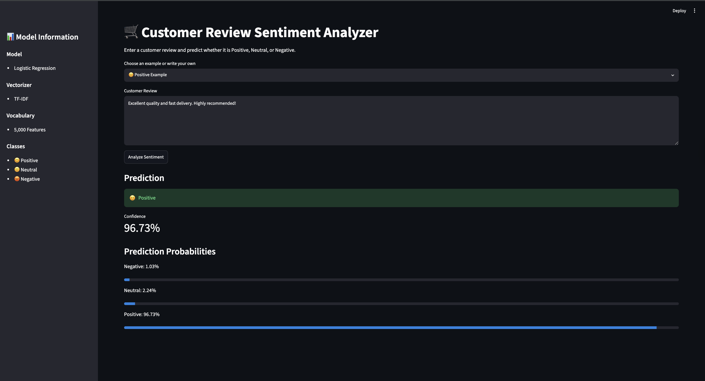
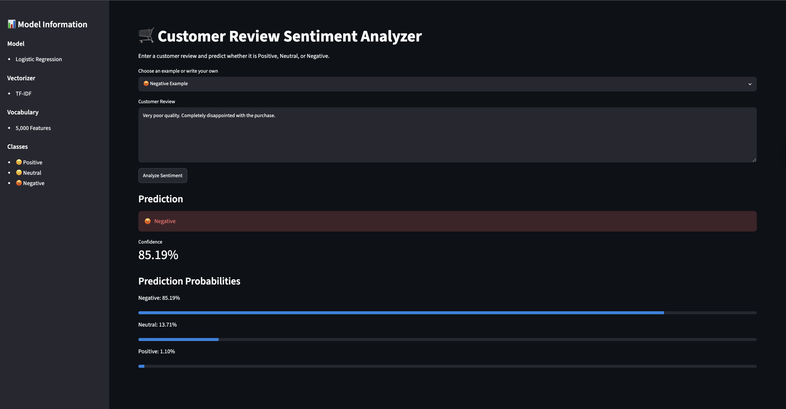

# 🛒 Customer Review Sentiment Analyzer

> An end-to-end Natural Language Processing (NLP) application that classifies customer reviews into **Positive**, **Neutral**, or **Negative** sentiment using TF-IDF vectorization, Logistic Regression, and an interactive Streamlit interface.

---

## Overview

Customer feedback provides valuable insights into product quality and user satisfaction, but manually analyzing large volumes of reviews is time-consuming.

This project presents an end-to-end sentiment analysis pipeline that transforms raw customer reviews into structured sentiment predictions through text preprocessing, TF-IDF feature extraction, machine learning classification, and an interactive Streamlit application.

The application predicts customer sentiment in real time while providing prediction confidence and class probability scores for improved interpretability.

---

# Features

* 💬 Real-time customer review sentiment prediction
* 🤖 Logistic Regression classifier
* 📄 TF-IDF text vectorization
* 📊 Prediction confidence scores
* 📈 Class probability visualization
* 🎯 Interactive Streamlit interface
* 📝 Example reviews for quick testing
* 🔁 Reproducible machine learning pipeline

---

# Application Workflow

```text
Customer Review
        │
        ▼
Text Preprocessing
        │
        ▼
TF-IDF Vectorization
        │
        ▼
Logistic Regression
        │
        ▼
Sentiment Prediction
        │
        ▼
Confidence Score & Probability Distribution
```

---

# Screenshots

## Positive Sentiment Prediction

<p align="center">

</p>

---

## Negative Sentiment Prediction

<p align="center">

</p>

---

# Machine Learning Pipeline

The project follows a traditional supervised learning workflow:

1. Load customer review dataset
2. Split into training and testing sets
3. Convert text into TF-IDF feature vectors
4. Train Logistic Regression classifier
5. Evaluate model performance
6. Save trained model using Joblib
7. Perform real-time inference through Streamlit

---

# Technology Stack

### Programming Language

* Python

### Machine Learning

* Scikit-learn
* Logistic Regression
* TF-IDF Vectorizer

### Data Processing

* Pandas
* NumPy

### Deployment Interface

* Streamlit

### Model Serialization

* Joblib

---

# Project Structure

```text
customer_review_sentiment_analyzer/

├── app.py                  # Streamlit application
├── train.py                # Model training script
├── model.pkl               # Trained classifier
├── vectorizer.pkl          # TF-IDF vectorizer
├── requirements.txt
├── README.md
│
├── dataset/
│     └── customer_reviews.csv
│
└── screenshots/
      ├── homepage.png
      ├── positive.png
      └── negative.png
```

---

# Running the Project

Clone the repository

```bash
git clone https://github.com/panicAtTheCompile/customer_review_sentiment_analyzer.git
```

Install dependencies

```bash
pip install -r requirements.txt
```

Launch the application

```bash
streamlit run app.py
```

---

# Future Improvements

* Transformer-based sentiment classification (BERT)
* Explainable AI using SHAP
* Cloud deployment
* Batch sentiment analysis
* REST API integration
* Aspect-based sentiment analysis
* Interactive analytics dashboard

---

# Author

**Harshita Pulavarti**

Engineering Undergraduate • IIT Kharagpur

Interested in Artificial Intelligence • Machine Learning • NLP • Data Science

---

## License

This project is released under the MIT License.
